<div align="center">

# Algoscope

**Watch algorithms think.**

27 classic algorithms, drawn live in SVG. Every step is narrated, every line of code lights up as it runs,<br/>and you can pause, rewind, set breakpoints and run your own inputs.

### [**▶ Open the live demo**](https://duc-minh-droid.github.io/algoscope/)

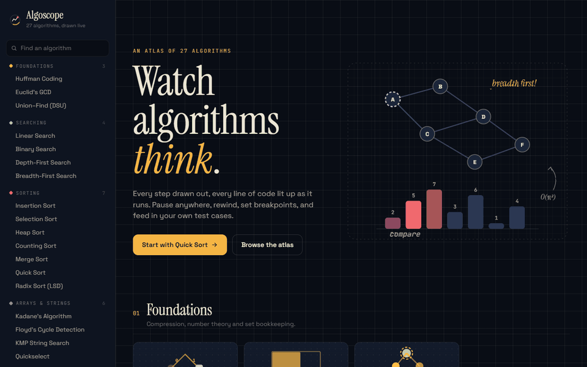

</div>

---

## Why this exists

Most algorithm visualizers play a canned animation of bars bouncing around. You watch it, nod, and you still couldn't write the code.

Algoscope treats every algorithm like a **debugger session you can scrub through**:

- **The code runs next to the picture.** JavaScript or Python, with the executing line highlighted in sync with the animation.
- **Every step explains itself.** Narration says *why* this step happens ("`7 < 9`, so update"), not just what moved.
- **Time is yours.** Play at 0.25× to 8×, step one frame at a time, drag the timeline, or click a line number to set a **breakpoint** and let playback run until the algorithm reaches it.
- **Your input, not ours.** Type an array, drag nodes around a graph canvas, or paint a maze. Inputs are validated with friendly errors, and every algorithm has edge-case presets and a random button.
- **A watch panel** shows live variables and flashes the ones that just changed.

<table>
  <tr>
    <td width="50%">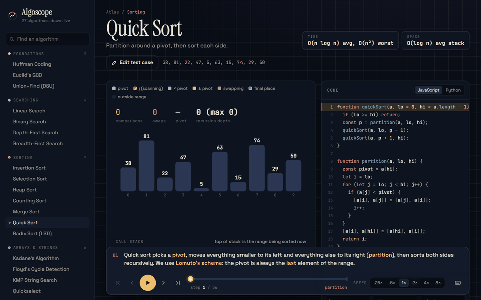</td>
    <td width="50%">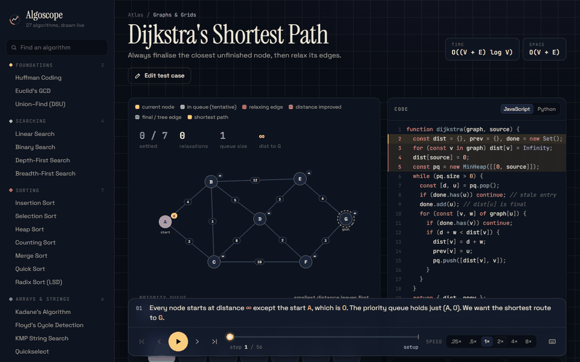</td>
  </tr>
  <tr>
    <td align="center"><b>Quick sort</b>: Lomuto partition regions, pivot placement, recursion stack</td>
    <td align="center"><b>Dijkstra</b>: priority queue, relaxations, shortest-path tree</td>
  </tr>
  <tr>
    <td>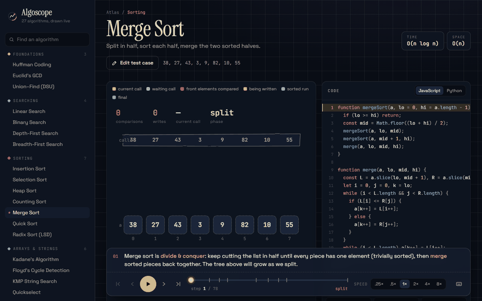</td>
    <td>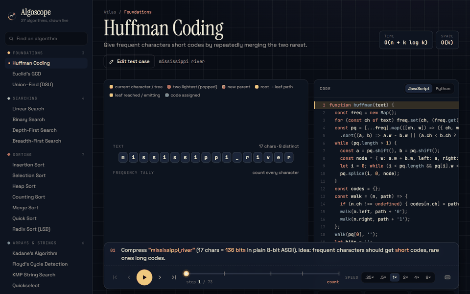</td>
  </tr>
  <tr>
    <td align="center"><b>Bring your own test case</b>: type it, run it, watch it</td>
    <td align="center"><b>Scrub anywhere</b>: drag the timeline, then step with ← →</td>
  </tr>
</table>

<div align="center">
  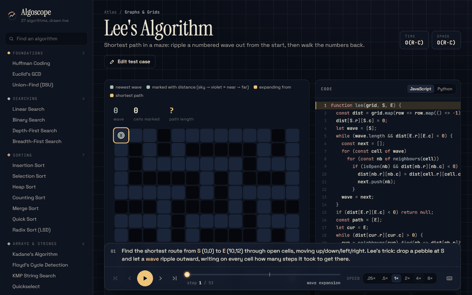<br/>
  <b>Lee's algorithm</b>: a numbered wave floods the maze, then the path is traced back
</div>

## The atlas

| Foundations | Searching | Sorting | Arrays & strings | Graphs & grids |
|---|---|---|---|---|
| Huffman coding | Linear search | Insertion sort | Kadane's algorithm | Kruskal's MST |
| Euclid's GCD | Binary search | Selection sort | Floyd's cycle detection | Dijkstra |
| Union–Find (DSU) | Depth-first search | Heap sort | KMP string search | Bellman–Ford |
| | Breadth-first search | Counting sort | Quickselect | Floyd–Warshall |
| | | Merge sort | Boyer–Moore majority vote | Topological sort (Kahn) |
| | | Quick sort | Two pointers / sliding window | Flood fill |
| | | Radix sort (LSD) | | Lee's algorithm |

Each one has its own visual idea rather than one generic template:

<table>
  <tr>
    <td width="50%">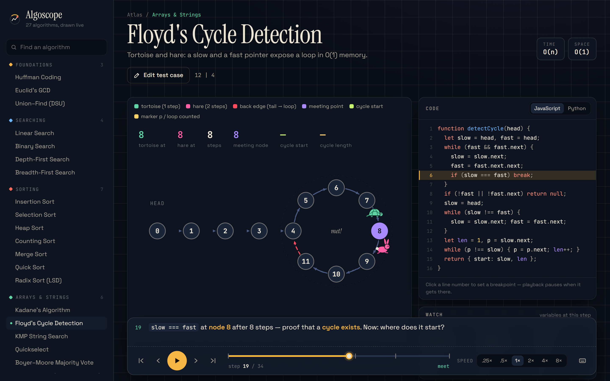</td>
    <td width="50%">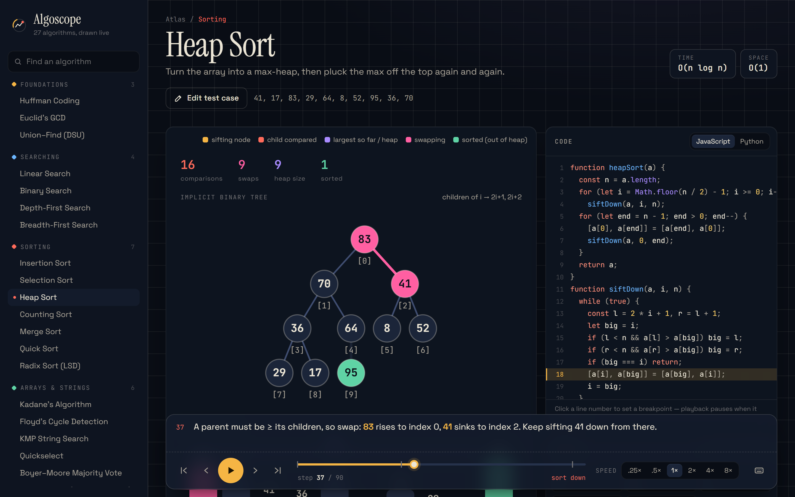</td>
  </tr>
  <tr>
    <td align="center">Floyd's cycle detection: a tortoise and a hare on a ρ-shaped list</td>
    <td align="center">Heap sort: the array and its implicit tree swap in sync</td>
  </tr>
  <tr>
    <td>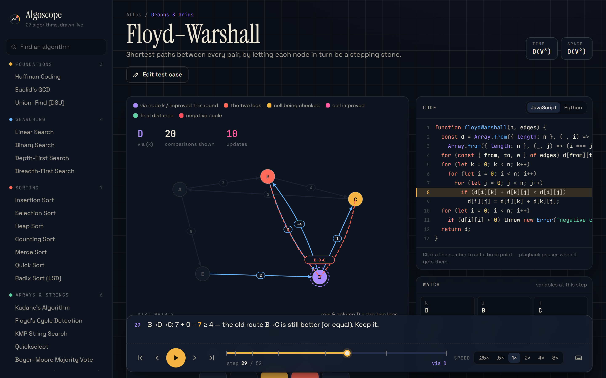</td>
    <td>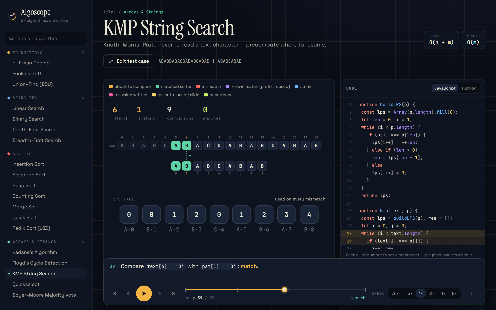</td>
  </tr>
  <tr>
    <td align="center">Floyd–Warshall: the matrix and the graph route update together</td>
    <td align="center">KMP: the pattern slides and skips ahead using the LPS table</td>
  </tr>
  <tr>
    <td>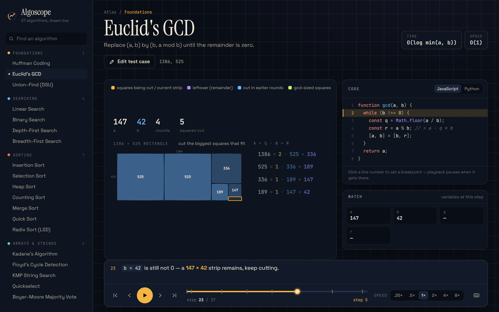</td>
    <td>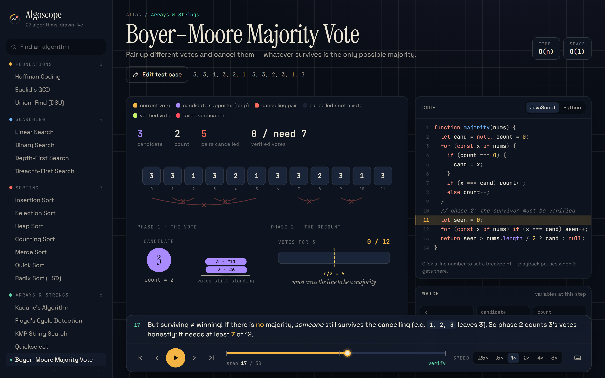</td>
  </tr>
  <tr>
    <td align="center">Euclid's GCD: carve the biggest squares out of an a×b rectangle</td>
    <td align="center">Boyer–Moore: different votes cancel in pairs, then a recount</td>
  </tr>
  <tr>
    <td>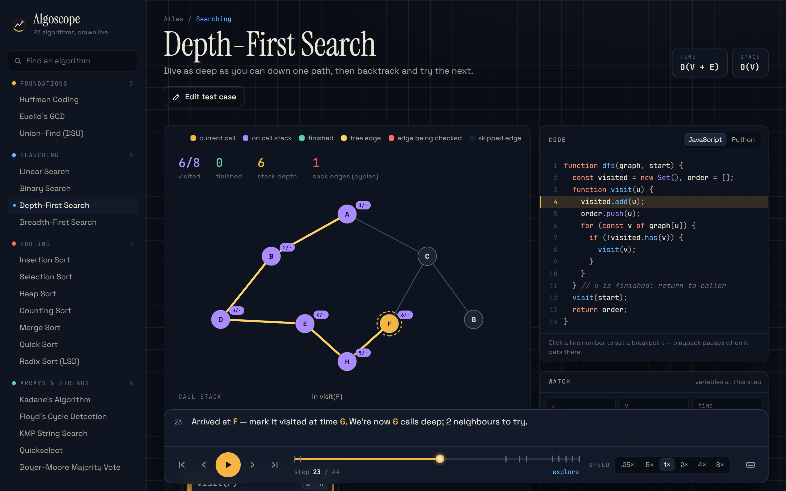</td>
    <td>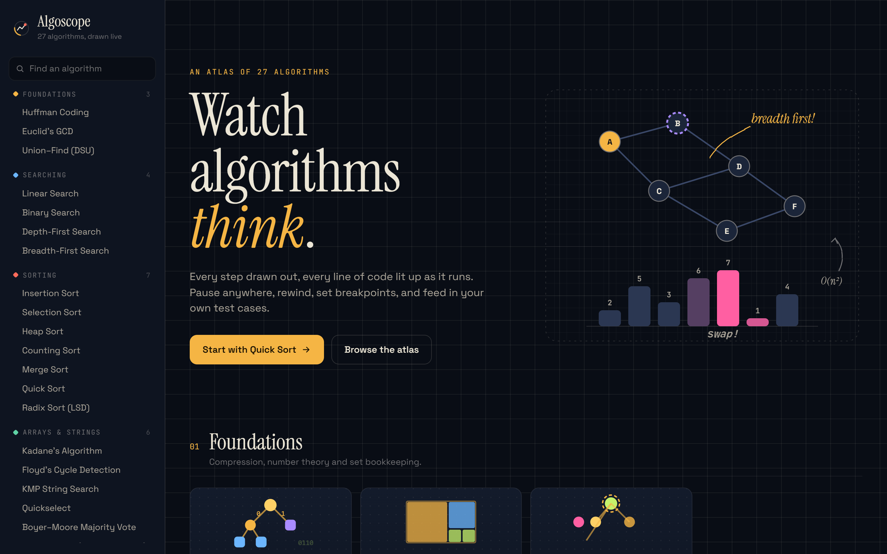</td>
  </tr>
  <tr>
    <td align="center">DFS: the recursion's call stack is drawn frame by frame</td>
    <td align="center">The home page</td>
  </tr>
</table>

## Keyboard

| Key | Action |
|---|---|
| <kbd>Space</kbd> | Play / pause |
| <kbd>←</kbd> <kbd>→</kbd> | Step back / forward |
| <kbd>Home</kbd> <kbd>End</kbd> | Jump to the first / last step |
| <kbd>[</kbd> <kbd>]</kbd> | Slower / faster |

## How it works

Algorithms are written as **generators** that yield immutable snapshots. The whole run is computed up front, so rewinding is just indexing into an array: there is no state to undo.

```ts
function* run(arr: number[]): Generator<Frame<State>> {
  for (let i = 0; i < arr.length; i++) {
    yield {
      state: { arr: [...arr], i },      // what the view draws
      line: 'cmp',                       // tag of the code line to highlight
      note: `Compare **${arr[i]}** with the target.`,
      vars: { i, 'arr[i]': arr[i] },     // watch panel
      phase: 'scan',                     // timeline marker
    };
  }
}
```

Code listings mark lines with trailing tags (`//@cmp` in JS, `#@cmp` in Python), and the highlighter finds them. Views are plain React components built from a small kit of SVG primitives: `ArrayView`, `GraphView` + a drag-and-drop `GraphEditor`, `GridView` + a paint-brush `GridEditor`, and `TreeView`. Motion comes from CSS transitions keyed by element identity, so a swap is two bars gliding past each other, timed to the playback speed. `prefers-reduced-motion` is respected.

Adding an algorithm means dropping a single file into `src/algorithms/<category>/`. It is registered automatically. See [`AGENTS.md`](AGENTS.md) for the full contract.

## Run it locally

```bash
npm install
npm run dev        # http://localhost:5173
npm run check      # runs every algorithm on its default, presets and 25 random inputs
npm run build
```

Stack: React 19 · TypeScript · Vite. No UI or animation libraries; it's hand-drawn SVG and CSS.

<details>
<summary>Regenerating the README media</summary>

```bash
npx vite --port 5391                 # in one terminal
node scripts/record-demo.mjs         # captures WebP frames + PNG stills via Chrome
python scripts/frames-to-gif.py      # stitches the frames into GIFs (needs Pillow)
```
</details>

## License

MIT
